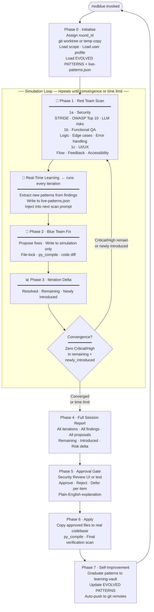

# Product Requirements Document
## Red-Blue Loop — Autonomous Quality Simulation Skill

**Author:** Joven Lee Wei Jun · [linkedin.com/in/jovenleeweijun](https://www.linkedin.com/in/jovenleeweijun/) · [x.com/jovenleeweijun](https://x.com/jovenleeweijun)
**Version:** 6.1 · © 2026 Joven Lee Wei Jun

---

## Problem Statement

### The pain

Development teams ship code faster than they can review it. Quality is treated as a gate — one check before a major release — not a continuous discipline. The result:

- Security vulnerabilities accumulate silently between releases
- Functional bugs go undetected because edge cases aren't systematically tested
- UI/UX problems compound because no one reviews the product holistically
- Tools find problems but don't propose solutions
- Proposed fixes are applied to production without validating that they work
- The same issue classes repeat across projects because fixes are never systematised

### The deeper problem: fixes that break things

The hardest part of remediation isn't finding the bug — it's verifying the fix. A naive patch for an injection vulnerability can introduce a path traversal. Fixing a functional edge case can break a related flow. Most teams apply fixes and hope for the best. There's no feedback loop.

### The opportunity

A simulation environment changes the dynamic entirely. If fixes are proposed and validated in a sandbox — and the red team re-scans that sandbox — you get a closed feedback loop that converges on a correct solution before anything touches real code. The human only enters the loop at the end, reviewing a complete, already-validated set of changes.

### Why three domains?

A product is only as good as all three of its quality layers:

| Domain | Question it answers |
|--------|-------------------|
| **Security** | Can someone exploit this? |
| **Functional correctness** | Does it actually work correctly? |
| **UI/UX quality** | Would a real user understand and trust this? |

Fixing a security hole in a product that doesn't work, or a product that's impossible to use, solves only one third of the problem.

---

## Goals

1. **Simulation-first** — blue team never touches real code during the loop
2. **Three-domain** — every scan covers security, functionality, and UI/UX quality
3. **Convergence-driven** — loop continues until all Critical/High issues are resolved in simulation
4. **Real-time learning** — patterns discovered in iteration N are injected into iteration N+1 immediately
5. **Full-session visibility** — at the end, the user sees the entire journey across all domains
6. **Approval-gated** — zero changes applied to real code without explicit per-item human decision
7. **Explainable** — every item explained in plain English at approval time
8. **Self-improving** — the skill learns from each session and gets better across all three domains
9. **Portable** — single Claude Code instance is sufficient; multi-agent scales up when available

---

## Non-Goals

- Not a penetration test (no active exploitation, no network attacks)
- Not a compliance framework (no SOC 2 / ISO 27001 reports)
- Not a runtime monitor (scans code at rest, not live systems)
- Not a replacement for human security engineers on high-stakes infrastructure
- Not a replacement for user research (does not conduct user interviews)

---

## Users

| User | Core need |
|------|-----------|
| Solo developer | Automated quality loop that proposes and validates fixes across security, function, and UX |
| Engineering team | Repeatable simulation-based review with approval records |
| AI agent builder | Audit LLM agent code for prompt injection, trust bypass, tool hijacking, and bad UX |
| Security professional | Auditable scan-fix-verify workflow they can hand off to a client |
| Product builder | Holistic quality check: does it work, is it safe, is it user-friendly? |

---

## The Simulation Loop



---

## Functional Requirements

### Session lifecycle
- FR-01: Assign round_id and create isolated simulation environment on session start
- FR-02: Default session time limit: 60 minutes (configurable per invocation)
- FR-03: Detect operation mode (NEXUS / SWARM / SOLO) automatically
- FR-04: Persist full session state to `~/.redblue/rounds/{round_id}.json`
- FR-05: Post status update to user after each iteration

### Simulation environment
- FR-06: Create git worktree for git repos (`git worktree add`)
- FR-07: Fall back to directory copy for non-git projects
- FR-08: Simulation path must be fully isolated — no writes to real project path during loop
- FR-09: Clean up simulation after approved changes are applied

### Red team scan — three domains
- FR-10: Scan all subsystems in scope per iteration across all three domains
- FR-11: Security domain: cover STRIDE threat model, OWASP Top 10, LLM-specific risks
- FR-12: Functional QA domain: cover logic errors, edge cases, error handling, data integrity
- FR-13: UI/UX domain: cover user flows, feedback states, accessibility, consistency
- FR-14: Run browser/UI scan for subsystems with web frontends
- FR-15: Run independent overseer pass for AI system core files
- FR-16: Inject EVOLVED PATTERNS and live-patterns.json into every scan prompt
- FR-17: Output structured JSON finding per issue with domain tag
- FR-18: Include plain-English layman explanation per finding

### Real-time learning (between every Phase 1 and Phase 2)
- FR-19: After each Phase 1 scan, extract new patterns from findings
- FR-20: Write extracted patterns to `~/.redblue/live-patterns.json` immediately
- FR-21: Inject live-patterns.json content into the next iteration's scan prompt
- FR-22: live-patterns.json accumulates across iterations within the same session

### Iteration delta
- FR-23: After each re-scan, compute: resolved / remaining / newly-introduced
- FR-24: Convergence condition: zero Critical/High in `remaining + newly_introduced`
- FR-25: Time limit is checked BEFORE starting a new iteration — never mid-iteration
- FR-25b: When the time limit is reached, the current iteration always completes in full (Phase 1 → learning → Phase 2 → Phase 3 → delta) before exiting to Phase 4
- FR-25c: Loop exits on convergence OR after the time-limit iteration completes — whichever comes first
- FR-26: Record per-iteration delta in session state

### Blue team (simulation)
- FR-27: Blue agents write actual code changes into the simulation environment only
- FR-28: File-lock enforced — no two agents touch the same file in the same iteration
- FR-29: Run `py_compile` on all Python files modified in simulation
- FR-30: Output structured proposal per change: code_before, code_after, domain, expected_outcome
- FR-31: Blue team may also identify enhancements (not just bug fixes)

### Full session report
- FR-32: Report covers entire session: all iterations, all findings, all proposals, all domains
- FR-33: Report includes: start/end severity counts per domain, risk delta, iteration history
- FR-34: Report lists proposed fixes with code diffs and confidence scores
- FR-35: Report lists remaining unresolved issues with reason
- FR-36: Report lists enhancements identified
- FR-37: Report lists issues newly introduced by blue team fixes

### Approval gate
- FR-38: Present report to Security Review UI (or text fallback)
- FR-39: Per-item decisions: approve / reject / defer + reason field
- FR-40: Round-level: APPROVE ALL / APPROVE CRITICAL+HIGH / SKIP SESSION
- FR-41: Agent explains each item in plain English before user decides
- FR-42: No changes applied until user submits decisions

### Apply approved changes
- FR-43: Copy approved files from simulation to real project path
- FR-44: `py_compile` on all Python files applied
- FR-45: Run final verification scan on modified real files
- FR-46: Report APPLIED / MISSING / REGRESSED per proposal
- FR-47: Clean up simulation environment after application

### Self-improvement
- FR-48: Graduate live-patterns.json entries to learning-vault after application (3+ sessions threshold)
- FR-49: Detect patterns in 3+ sessions → add to EVOLVED PATTERNS
- FR-50: Mark dormant patterns (absent 5+ sessions)
- FR-51: Mark false-positive patterns (FP in 2+ sessions)
- FR-52: Adjust Phase 1 scan hints when classes of findings are repeatedly missed
- FR-53: Add Phase 2 warnings when fix types consistently introduce new bugs
- FR-54: Update user profile after every session (per-domain approval rates)
- FR-55: Auto-push evolved skill to all configured git remotes

---

## Non-Functional Requirements

- NFR-01: Real code is never modified during the simulation loop
- NFR-02: Simulation environment is fully isolated from the real project path
- NFR-03: Approval gate cannot be bypassed — no apply without explicit user decision
- NFR-04: File-lock prevents blue agent conflicts within an iteration
- NFR-05: All state stored locally in `~/.redblue/` — no external service required
- NFR-06: Push failures are non-blocking — logged and surfaced but loop continues
- NFR-07: No secrets, personal paths, or API keys in the skill file
- NFR-08: User profile is never published or committed to public repos
- NFR-09: Real-time learning writes to live-patterns.json must complete before Phase 2 begins

---

## Data Model

### Session state (`~/.redblue/rounds/{round_id}.json`)

```json
{
  "round_id": "redblue-2026-05-14-01",
  "started_at": "2026-05-14T08:00:00Z",
  "time_limit_minutes": 60,
  "mode": "NEXUS|SWARM|SOLO",
  "sim_path": "~/.redblue/sim/redblue-2026-05-14-01/",
  "sim_type": "worktree|copy",
  "status": "running|converged|time_limit|pending_approval|applied",
  "iterations": [
    {
      "iteration": 1,
      "started_at": "ISO",
      "red_findings": [],
      "live_patterns_added": [],
      "blue_proposals": [],
      "resolved_from_prior": [],
      "newly_introduced": [],
      "remaining": [],
      "converged": false
    }
  ],
  "final_report": {},
  "user_decisions": {
    "{proposal_id}": {
      "decision": "approved|rejected|deferred",
      "reason": "",
      "decided_at": "ISO"
    }
  },
  "apply_results": {
    "{proposal_id}": "APPLIED|MISSING|REGRESSED"
  }
}
```

### Finding schema

```json
{
  "id": "redblue-2026-05-14-01-I1-AUTH-001",
  "domain": "security|functional|ux",
  "type": "bug|vulnerability|enhancement",
  "severity": "critical|high|medium|low|info",
  "confidence": "high|medium|low",
  "category": "STRIDE/OWASP/functional/ux ref",
  "title": "short name",
  "file": "path:line",
  "description": "technical detail",
  "reproduction_steps": ["step1", "step2"],
  "impact": "what breaks or what improves",
  "suggestion": "one-sentence fix direction",
  "cvss_estimate": 7.5,
  "layman": "plain English explanation"
}
```

### Proposal schema

```json
{
  "proposal_id": "redblue-2026-05-14-01-I1-AUTH-001-FIX",
  "finding_id": "redblue-2026-05-14-01-I1-AUTH-001",
  "domain": "security|functional|ux",
  "type": "fix|enhancement",
  "file": "server/auth.py:42",
  "description": "Added Depends(get_current_user) to admin_route",
  "expected_outcome": "Unauthenticated requests return 401",
  "code_before": "...",
  "code_after": "...",
  "py_compile": "PASS",
  "confidence": "high"
}
```

### live-patterns.json (real-time learning buffer)

```json
{
  "session_id": "redblue-2026-05-14-01",
  "patterns": [
    {
      "id": "LP-2026-05-14-01-001",
      "domain": "security|functional|ux",
      "discovered_iteration": 1,
      "pattern": "Unvalidated redirect after OAuth callback",
      "check": "redirect_uri not validated against allowlist",
      "severity": "high",
      "occurrence_count": 1,
      "graduated": false
    }
  ]
}
```

---

## Success Metrics

| Metric | Target |
|--------|--------|
| Simulation isolation | 0 modifications to real code during loop |
| Convergence rate | ≥ 70% of sessions reach full convergence within time limit |
| Fix validation accuracy | ≥ 85% of approved fixes verified APPLIED in final scan |
| New-issue introduction rate | < 10% of blue team fixes introduce a new Critical/High |
| User approval rate | ≥ 60% of proposed fixes approved |
| Pattern growth | ≥ 1 new EVOLVED PATTERN per 5 sessions |
| False positive rate after 10 sessions | < 15% |
| Domain coverage | All three domains (security + functional + UX) represented in ≥ 90% of sessions |
| Real-time learning uptake | live-patterns.json populated within iteration 1 in ≥ 80% of sessions |

---

**© 2026 Joven Lee Wei Jun · [linkedin.com/in/jovenleeweijun](https://www.linkedin.com/in/jovenleeweijun/) · [x.com/jovenleeweijun](https://x.com/jovenleeweijun)**
