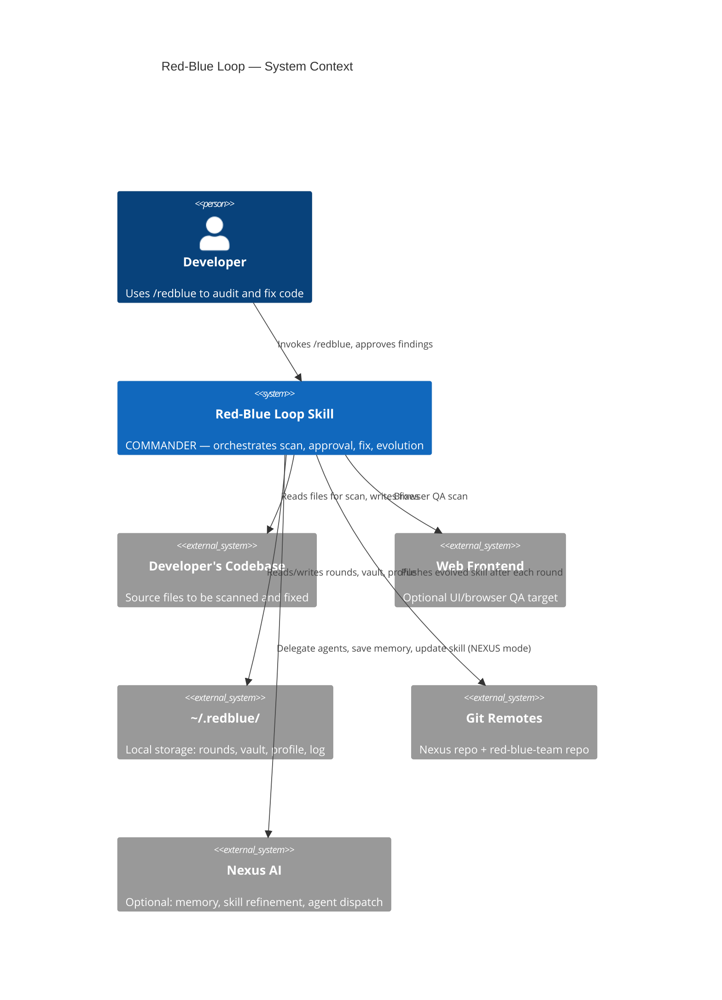

# Product Requirements Document
## Red-Blue Loop — Autonomous Security Audit Skill

**Author:** Joven Lee Wei Jun · [linkedin.com/in/jovenleeweijun](https://www.linkedin.com/in/jovenleeweijun/)
**Version:** 4.0 · © 2026 Joven Lee Wei Jun

---

## Problem Statement

### The pain

Security is treated as a one-time gate or an afterthought. Most development teams:
- Audit code only before a major release, missing issues that accumulate daily
- Hire security consultants at high cost for point-in-time snapshots that age immediately
- Receive vulnerability reports that are either too technical (developers can't act on them) or too vague (no concrete fix direction)
- Fix vulnerabilities without verifying the fix actually resolves the root cause
- Repeat the same classes of vulnerabilities across projects because lessons are never systematised

### The gap

AI coding assistants generate code fast. Security tooling hasn't kept pace. Existing static analysis tools (Semgrep, Bandit, SonarQube) are rule-based — they don't explain, don't adapt, don't fix, and don't learn. They produce noise that developers learn to ignore.

### The opportunity

LLM-powered agents can reason about code the way a security engineer does — understanding context, chaining vulnerabilities, explaining impact in plain English, and generating targeted fixes. The gap is that no one has built a structured, repeatable, approval-gated workflow that turns this capability into something safe to run continuously.

---

## Goals

1. **Continuous** — run automatically as a loop, not a one-time event
2. **Comprehensive** — cover code security (STRIDE/OWASP), web UI security (XSS, auth bypass), and AI-specific risks (prompt injection, trust boundaries)
3. **Approval-gated** — zero changes to production code without explicit human sign-off
4. **Explainable** — every finding explained in plain English alongside its technical detail
5. **Self-improving** — the skill learns from its own findings and gets better at catching them
6. **Portable** — works with a single Claude Code instance; scales to multi-agent if available

---

## Non-Goals

- **Not a replacement for human security engineers** on high-stakes production systems
- **Not a penetration test** — no active exploitation, no network attacks, no real credential testing
- **Not a compliance scanner** — doesn't produce SOC 2 / ISO 27001 reports
- **Not a runtime monitor** — scans code at rest, not running systems

---

## Users

| User | Need |
|------|------|
| Solo developer | Catch vulnerabilities before shipping without hiring a security firm |
| Small engineering team | Repeatable security review without a dedicated security engineer |
| AI agent builder | Audit AI agent code for LLM-specific risks (prompt injection, trust bypass) |
| Security professional | Structured, auditable scan-fix workflow they can run on client codebases |

---

## Functional Requirements

### Scanning
- FR-01: Scan any local codebase given a directory path
- FR-02: Cover STRIDE threat model across all scanned files
- FR-03: Cover OWASP Top 10 with file:line citations
- FR-04: Cover LLM-specific risks when AI agent code is in scope
- FR-05: Run browser/UI scan on any subsystem with a web frontend
- FR-06: Run an independent overseer pass when scanning AI system core files
- FR-07: Inject evolved patterns from prior rounds into every scan prompt
- FR-08: Accept a user profile to adjust scan priorities

### Findings
- FR-09: Every finding includes: id, severity, confidence, category, title, file:line, description, reproduction steps, impact, remediation hint, CVSS estimate, plain-English explanation
- FR-10: Findings deduplicated by (file, title) across parallel agents
- FR-11: Findings scored by `cvss × confidence_weight` and sorted by priority

### Approval gate
- FR-12: Present round report and halt — no fixes until approved
- FR-13: Support per-finding approve / reject / defer decisions
- FR-14: Support round-level actions: APPROVE / APPROVE CRITICAL / SKIP [ids] / SKIP ALL
- FR-15: Accept optional user rating (1–5) per round
- FR-16: Optional: Security Review UI (FastAPI + React) for visual approval

### Fixing
- FR-17: Dispatch fix agents only for approved findings
- FR-18: Enforce file-lock — no two agents touch the same file
- FR-19: Each fix agent states a Goal Declaration before first file change
- FR-20: Validate all Python fixes with `py_compile` before marking complete
- FR-21: Run retest agent to verify each fix against its declared outcomes

### Self-improvement
- FR-22: Log every Critical/High fix to learning vault with violation + prevention rule
- FR-23: Detect patterns appearing 3+ times → add to EVOLVED PATTERNS section
- FR-24: Mark dormant patterns (not seen in 5+ rounds)
- FR-25: Mark false-positive patterns (FP in 2+ rounds)
- FR-26: Update workflow phases when scan/fix instructions are found lacking
- FR-27: Update user profile after every round
- FR-28: Auto-push updated skill to all configured git remotes

### Modes
- FR-29: SOLO mode — all phases run sequentially with one agent
- FR-30: SWARM mode — parallel agents via `delegate_task`
- FR-31: NEXUS mode — SWARM + Nexus memory + nexus_scribe skill refinement
- FR-32: Auto-detect mode on startup

---

## Non-Functional Requirements

- NFR-01: **No secrets in skill file** — no API keys, no personal paths, no credentials
- NFR-02: **User profile is local-only** — `user-profile.json` never committed to git
- NFR-03: **Approval gate is hard** — the skill must not apply fixes without an explicit APPROVE response
- NFR-04: **File-lock is enforced** — blue team agents cannot touch files outside their declared scope
- NFR-05: **Portable storage** — all state lives in `~/.redblue/`, no external database
- NFR-06: **Attribution preserved** — author credit visible in skill file and any generated reports
- NFR-07: **Push failures non-blocking** — auto-sync failure logs and reports but does not halt the round

---

## Success Metrics

| Metric | Target |
|--------|--------|
| Vulnerability detection rate | ≥ 80% of known classes in OWASP Top 10 caught per scan |
| False positive rate | < 15% of findings are false positives after 5 rounds |
| Pattern growth | EVOLVED PATTERNS section grows with every 3 rounds of usage |
| User approval rate | Users approve ≥ 60% of Critical/High findings for fixing |
| Fix retest pass rate | ≥ 90% of blue-team fixes pass retest on first attempt |
| Self-improvement frequency | At least 1 new evolved pattern added per 5 rounds |

---

## Architecture Overview



---

## Data Model

### Round manifest (`~/.redblue/rounds/{round_id}.json`)

```json
{
  "round_id": "redblue-2026-05-14-01",
  "date": "2026-05-14",
  "mode": "NEXUS|SWARM|SOLO",
  "phase": "red|aggregate|report|fix|done",
  "overseer_signoff": true,
  "blind_spots": [],
  "status": "scanning|pending|dispatched|skipped",
  "rating": 4,
  "findings": [
    {
      "id": "redblue-2026-05-14-01-AUTH-001",
      "severity": "critical",
      "confidence": "high",
      "category": "EoP — OWASP A01",
      "title": "Missing auth decorator on admin route",
      "file": "server/routes/admin.py:42",
      "description": "...",
      "reproduction_steps": ["..."],
      "impact": "...",
      "remediation_hint": "...",
      "cvss_estimate": 9.1,
      "layman": "Any visitor can access admin controls without logging in.",
      "decision": "approved|rejected|deferred|pending",
      "reason": "",
      "decided_at": 1715694000
    }
  ]
}
```

### Learning vault (`~/.redblue/learning-vault.json`)

```json
[
  {
    "id": "redblue-2026-05-14-01-AUTH-001",
    "round": "redblue-2026-05-14-01",
    "violation": "Route missing auth decorator allows unauthenticated access",
    "what_should_have_happened": "Every route must have Depends(get_current_user) or @login_required",
    "fixed": true,
    "retest_pass": true,
    "occurrence_count": 3,
    "verification_due": "2026-05-21"
  }
]
```

### User profile (`~/.redblue/user-profile.json`)

```json
{
  "rounds_completed": 12,
  "stack_signature": ["python", "fastapi", "react", "telegram"],
  "approval_rates": {
    "critical": 0.97,
    "high": 0.84,
    "medium": 0.38,
    "low": 0.09,
    "info": 0.0
  },
  "skipped_categories": ["binding-localhost"],
  "preferred_agents": 6,
  "avg_rating": 4.1,
  "last_updated": "2026-05-14"
}
```

---

**© 2026 Joven Lee Wei Jun · [linkedin.com/in/jovenleeweijun](https://www.linkedin.com/in/jovenleeweijun/)**
