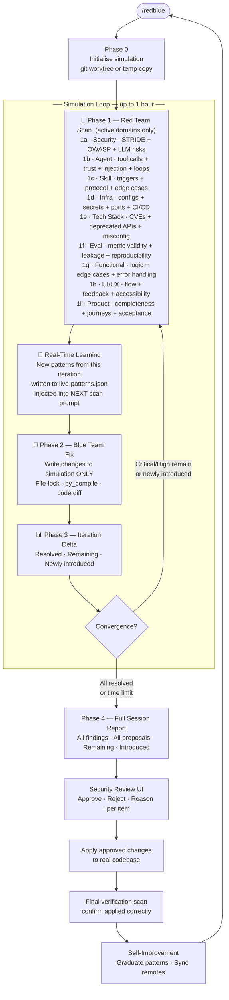
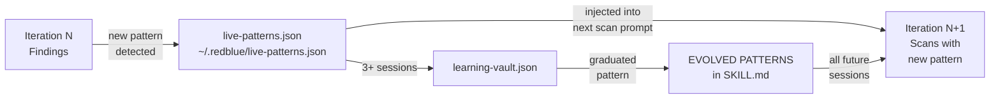
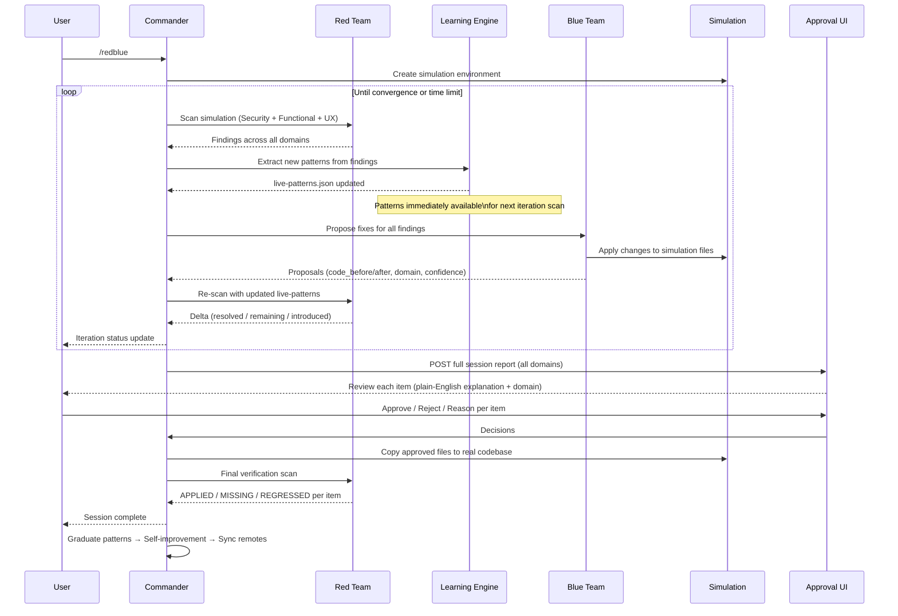
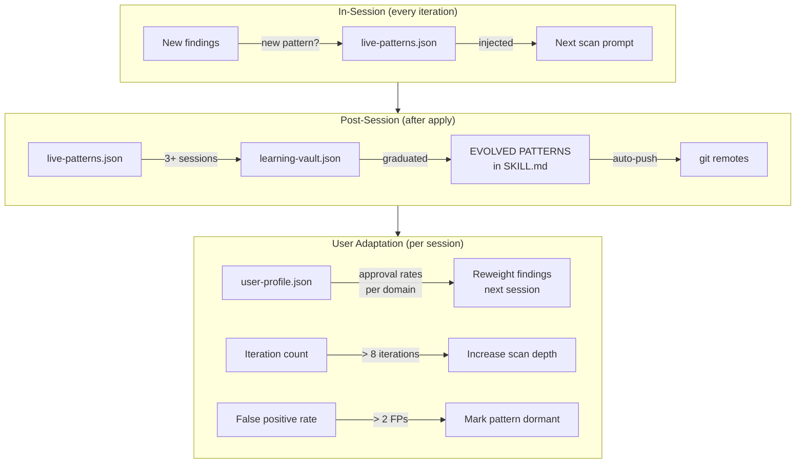

# Red-Blue Loop

**A continuous simulation loop that finds issues, proposes fixes, and re-validates — across security, agents, skills, infrastructure, tech stack, evals, functionality, UI/UX, and product quality — before anything touches your real code.**

> **by Joven Lee** · [linkedin.com/in/jovenleeweijun](https://www.linkedin.com/in/jovenleeweijun/) · [x.com/jovenleeweijun](https://x.com/jovenleeweijun)
> © 2026 Joven Lee Wei Jun · Licensed CC BY-NC-ND 4.0

---

## For Everyone: What is this?

Imagine hiring a quality team that works in a parallel universe — a perfect copy of your codebase where they can try fixes, break things, rebuild them, and check if their fixes introduced new problems. Only after they've converged on a complete solution do they present it to you for a final sign-off. Your real code is never touched until you say so.

That's what Red-Blue Loop does — across **eight quality domains**, auto-detected from your project:

| Domain | What it checks |
|--------|---------------|
| 🔴 **Security** | Vulnerabilities, auth issues, injection risks, exposed secrets |
| 🤖 **Agent** | AI agent behaviour — tool calls, trust boundaries, prompt injection, memory integrity |
| 🧠 **Skill** | Skill file correctness — triggers, protocol completeness, edge cases, inter-skill conflicts |
| 🏗️ **Infra** | Deployment configs, secrets in config, exposed ports, CI/CD safety, health checks |
| 📦 **Tech Stack** | Vulnerable dependencies, deprecated APIs, version incompatibilities, framework misconfig |
| 📊 **Eval** | Evaluation harness validity, metric correctness, eval leakage, result reproducibility |
| 🟡 **Functional** | Logic errors, edge cases, error handling, integration correctness |
| 🔵 **UI / UX** | User flows, missing feedback states, accessibility, consistency |
| 🛒 **Product** | Feature completeness, acceptance criteria gaps, user journey coherence |

**In plain English, here's how a session works:**

1. 🔴 **Red team scans** your code across all three domains
2. 🔵 **Blue team proposes fixes** in a sandboxed copy of your code — never your real files
3. 🧠 **The skill learns in real-time** — patterns found in this iteration are immediately injected into the next scan
4. 🔴 **Red team scans again** on the updated sandbox — did the fixes work? did they introduce new problems?
5. 🔄 **Loop repeats** — until everything is resolved, or the time limit is up (default: 1 hour). When the hour runs out, the current iteration always finishes in full before stopping — no loose ends left mid-round
6. 📋 **Full report** — complete picture: what was found, what was fixed in simulation, what still needs work
7. ✅ **You decide** — review every item with a plain-English explanation, approve or reject each one
8. 🚀 **Applied** — only approved changes land in your real code

**The key difference from other tools:**
Most tools find problems and stop there. Red-Blue Loop runs a full simulation to figure out the best fix and validates that the fix actually works — across all three quality domains — before asking you to approve anything.

---

## For Technical Users

### The simulation loop



### Eight quality domains

Every scan activates all domains relevant to your project (auto-detected from project structure):

| Domain | Auto-detects when | What red team looks for |
|--------|-------------------|------------------------|
| 🔴 **Security** | Always | STRIDE, OWASP Top 10, LLM-specific risks, secrets, auth gaps |
| 🤖 **Agent** | `agent/`, `openai`, `anthropic` imports | Tool misuse, trust violations, prompt injection, loop safety, graceful degradation |
| 🧠 **Skill** | `skills/`, `SKILL.md` | Trigger correctness, protocol completeness, edge cases, versioning |
| 🏗️ **Infra** | Dockerfile, docker-compose, k8s, `.env` | Secrets in config, exposed ports, privilege escalation, CI/CD safety |
| 📦 **Tech Stack** | `package.json`, `requirements.txt` | CVEs, deprecated APIs, version incompatibilities, misconfigs |
| 📊 **Eval** | `eval/`, `benchmark/`, test harnesses | Metric validity, eval leakage, scoring bugs, reproducibility |
| 🟡 **Functional** | Always | Logic errors, edge cases, error handling, integration correctness |
| 🔵 **UI / UX** | `frontend_url` in scope config | Flow logic, missing feedback, accessibility, consistency |
| 🛒 **Product** | Always | Feature completeness, acceptance gaps, user journey coherence |

### Real-time learning

The skill doesn't just get smarter after sessions — it gets smarter **between iterations within the same session**:



Each iteration builds on what the previous one discovered. By iteration 3, the red team is scanning with everything it learned in iterations 1 and 2.

### Operation modes

| Mode | Requirements | Parallelism |
|------|-------------|-------------|
| **SOLO** | Any Claude Code instance | Sequential iterations |
| **SWARM** | Any `delegate_task` framework | Parallel scan + fix agents per iteration |
| **NEXUS** | Nexus AI framework | Full parallel + Nexus memory + auto skill refinement |

### Agent architecture

```mermaid
flowchart LR
    subgraph COMMANDER [COMMANDER]
        C[/redblue\nSession orchestrator]
    end

    subgraph SIM ["Simulation — ~/.redblue/sim/round_id/"]
        SF[Sandboxed\ncopy of codebase]
    end

    subgraph RED ["🔴 Red Team — reads sim, never writes"]
        R1[Security\nAgent]
        R2[Functional QA\nAgent]
        R3[UI/UX\nAgent]
        ROV[Overseer\nindependent re-scan]
    end

    subgraph BLUE ["🔵 Blue Team — writes to sim only"]
        B1[Fix Agent 1\nFile cluster A]
        B2[Fix Agent 2\nFile cluster B]
        BN[Fix Agent N\nFile cluster ...]
    end

    subgraph LEARN ["🧠 Real-Time Learning"]
        LP[live-patterns.json\nPattern buffer]
    end

    C -->|scan sim| R1 & R2 & R3 & ROV
    R1 & R2 & R3 & ROV -->|findings| C
    C -->|new patterns| LP
    LP -->|injected into next scan| R1 & R2 & R3
    C -->|propose fixes in sim| B1 & B2 & BN
    B1 & B2 & BN -->|proposals + changes| SF
    SF -->|next iteration| R1
```

### What "simulation" means technically

The simulation is a git worktree (or a directory copy for non-git projects):
- `git worktree add ~/.redblue/sim/{round_id}` creates an isolated branch
- Blue team agents edit real files inside that worktree
- `py_compile` runs against those files so syntax is validated
- Red team scans the same path the next iteration
- At approval time, changed files are copied/merged into the main project

Blue team proposals are actual code, not pseudocode — they get validated by the same scan logic that found the problems.

### Convergence

The loop exits when:
- No Critical or High severity findings remain in simulation **AND** no Critical/High newly introduced, **OR**
- The session time limit is reached (default 60 minutes, configurable)

### Iteration delta tracking

Each re-scan computes:
- **Resolved** — issues from iteration N-1 that no longer appear
- **Remaining** — issues from N-1 that still appear (fix didn't work)
- **Newly introduced** — issues in iteration N not present before (blue team's fix caused a new problem)

This three-way delta is the core feedback loop — it tells blue team exactly what their fix broke.

---

## Workflow: full session view



---

## Self-Improvement Loop



---

## Security Review UI (optional)

A FastAPI router and React component for the approval interface.
Each item shows: domain badge, severity badge, CVSS score, plain-English explanation, code diff, approve/reject/defer buttons with reason input.

```
server/security.py         ← FastAPI: /api/security/rounds
client/SecurityReview.tsx  ← React approval UI
```

Phase 5 text approval works without these if you prefer.

---

## Install

```bash
git clone git@github.com:jovenleewj-png/red-blue-team.git
mkdir -p ~/.redblue/rounds
mkdir -p ~/.nexus/skills/red-blue-loop
cp red-blue-team/SKILL.md ~/.nexus/skills/red-blue-loop/SKILL.md
cp red-blue-team/scope.example.yaml ~/.redblue/scope.yaml
# Edit scope.yaml with your system paths
```

---

## Usage

```
/redblue                  full scope, loop until convergence or 1 hour
/redblue {subsystem}      single subsystem
/redblue 30m              custom time limit
/redblue ui               include browser QA
/redblue report only      show last session report
/redblue apply approved   apply pre-decided proposals
/redblue solo             force SOLO mode
/redblue profile          show what the skill learned about your usage
/redblue evolve           self-improvement pass only
```

---

## Contributing

If the simulation loop surfaces a pattern in your codebase that proves universal,
contribute it back to EVOLVED PATTERNS via PR:

1. Fork this repo
2. Add your pattern to `## EVOLVED PATTERNS` following the existing format
3. Include: detected version, domain (security/functional/ux), occurrence count, check string, auto-flag status
4. Submit PR — reviewed by Joven Lee before merging

---

## License and Attribution

**CC BY-NC-ND 4.0** — See [TERMS.md](TERMS.md) for full terms.

Any output shared publicly must credit: *"Quality audit powered by Red-Blue Loop by Joven Lee Wei Jun."*

**© 2026 Joven Lee Wei Jun · [linkedin.com/in/jovenleeweijun](https://www.linkedin.com/in/jovenleeweijun/) · [x.com/jovenleeweijun](https://x.com/jovenleeweijun)**
