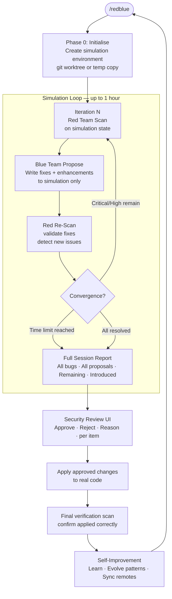
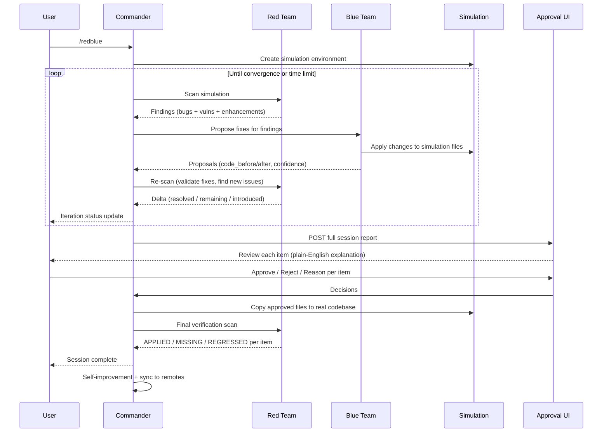
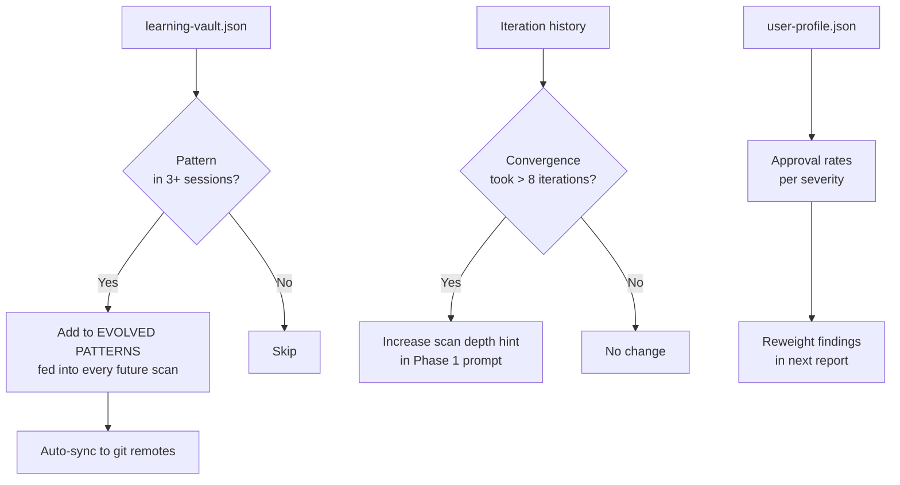

# Red-Blue Loop

**A continuous simulation loop that finds, proposes fixes for, and re-validates security issues in your codebase — before anything touches your real code.**

> **by Joven Lee** · [linkedin.com/in/jovenleeweijun](https://www.linkedin.com/in/jovenleeweijun/)
> © 2026 Joven Lee Wei Jun · Licensed CC BY-NC-ND 4.0

---

## For Everyone: What is this?

Imagine hiring a security team that works in a parallel universe — a perfect copy of your codebase where they can try fixes, break things, rebuild them, and check if their fixes introduced new problems. Only after they've converged on a complete solution do they present it to you for a final sign-off. Your real code is never touched until you say so.

That's what Red-Blue Loop does.

**In plain English, here's how a session works:**

1. 🔴 **Red team scans** your code — finds bugs, security holes, and improvement opportunities
2. 🔵 **Blue team proposes fixes** — in a sandboxed copy of your code, never your real files
3. 🔴 **Red team scans again** — now on the sandbox with blue's fixes applied. Did they work? Did they introduce new problems?
4. 🔄 **Repeat** — until everything is resolved, or the time limit is up (default: 1 hour)
5. 📋 **Full report** — after the session, you get the complete picture: what was found, what was fixed in simulation, what still needs work, what improvements are suggested
6. ✅ **You decide** — review every item with a plain-English explanation, approve or reject each one
7. 🚀 **Applied** — only approved changes land in your real code

**The key difference from other security tools:**
Most tools find problems and stop there. This one runs a full simulation to figure out the best way to fix each problem and validates that the fix actually works — before asking you to approve anything.

---

## For Technical Users

### The simulation loop



### Operation modes

| Mode | Requirements | Parallelism |
|------|-------------|-------------|
| **SOLO** | Any Claude Code instance | Sequential iterations |
| **SWARM** | Any `delegate_task` framework | Parallel scan + fix agents per iteration |
| **NEXUS** | Nexus AI framework | Full parallel + Nexus memory + auto skill refinement |

### Agent architecture

```mermaid
flowchart LR
    subgraph COMMANDER [COMMANDER]
        C[/redblue\nSession orchestrator]
    end

    subgraph SIM [Simulation Environment — ~/.redblue/sim/round_id/]
        SF[Sandboxed\ncopy of codebase]
    end

    subgraph RED [Red Team — reads sim, never writes]
        R1[Scan Agent 1]
        R2[Scan Agent 2]
        RN[Scan Agent N]
        RUI[UI-QA Agent\nbrowser + files]
        ROV[Overseer Pass\nindependent re-scan]
    end

    subgraph BLUE [Blue Team — writes to sim only]
        B1[Fix Agent 1\nFile cluster A]
        B2[Fix Agent 2\nFile cluster B]
        BN[Fix Agent N\nFile cluster ...]
    end

    C -->|scan sim| R1 & R2 & RN & RUI & ROV
    R1 & R2 & RN & RUI & ROV -->|findings| C
    C -->|propose fixes in sim| B1 & B2 & BN
    B1 & B2 & BN -->|proposals + changes| SFw[Simulation files updated]
    SFw --> R1
    SF --- SFw
```

### What "simulation" means technically

The simulation is a git worktree (or a directory copy for non-git projects):
- `git worktree add ~/.redblue/sim/{round_id}` creates an isolated branch
- Blue team agents edit real files inside that worktree
- `py_compile` runs against those files so syntax is validated
- Red team scans the same path the next iteration
- At approval time, changed files are copied/merged into the main project

This means blue team proposals are actual code, not pseudocode — they get validated by the same scan logic that found the problems.

### Convergence

The loop exits when:
- No Critical or High severity findings remain in simulation, **OR**
- The session time limit is reached (default 60 minutes, configurable)

The convergence state is recorded per iteration so the final report shows exactly how many passes were needed to resolve each issue.

### Iteration delta tracking

Each re-scan computes:
- **Resolved** — issues from iteration N-1 that no longer appear
- **Remaining** — issues from N-1 that still appear (fix didn't work)
- **Newly introduced** — issues in iteration N not present before (blue team's fix caused a new problem)

This three-way delta is the core feedback loop — it tells blue team exactly what their fix broke.

---

## Workflow: full session view



---

## Self-Improvement Loop



---

## Security Review UI (optional)

A FastAPI router and React component for the approval interface.
Each item shows: severity badge, CVSS score, plain-English explanation, code diff, approve/reject/defer buttons with reason input.

```
server/security.py         ← FastAPI: /api/security/rounds
client/SecurityReview.tsx  ← React approval UI
```

Phase 5 text approval works without these if you prefer.

---

## Install

```bash
git clone git@github.com:jovenleewj-png/red-blue-team.git
mkdir -p ~/.redblue/rounds
mkdir -p ~/.nexus/skills/red-blue-loop
cp red-blue-team/SKILL.md ~/.nexus/skills/red-blue-loop/SKILL.md
cp red-blue-team/scope.example.yaml ~/.redblue/scope.yaml
# Edit scope.yaml with your system paths
```

---

## Usage

```
/redblue                  full scope, loop until convergence or 1 hour
/redblue {subsystem}      single subsystem
/redblue 30m              custom time limit
/redblue ui               include browser QA
/redblue report only      show last session report
/redblue apply approved   apply pre-decided proposals
/redblue solo             force SOLO mode
/redblue profile          show what the skill learned about your usage
/redblue evolve           self-improvement pass only
```

---

## Contributing

If the simulation loop surfaces a pattern in your codebase that proves universal,
contribute it back to EVOLVED PATTERNS via PR:

1. Fork this repo
2. Add your pattern to `## EVOLVED PATTERNS` following the existing format
3. Include: detected version, occurrence count, check string, auto-flag status
4. Submit PR — reviewed by Joven Lee before merging

---

## License and Attribution

**CC BY-NC-ND 4.0** — See [TERMS.md](TERMS.md) for full terms.

Any output shared publicly must credit: *"Security audit powered by Red-Blue Loop by Joven Lee Wei Jun."*

**© 2026 Joven Lee Wei Jun · [linkedin.com/in/jovenleeweijun](https://www.linkedin.com/in/jovenleeweijun/)**
