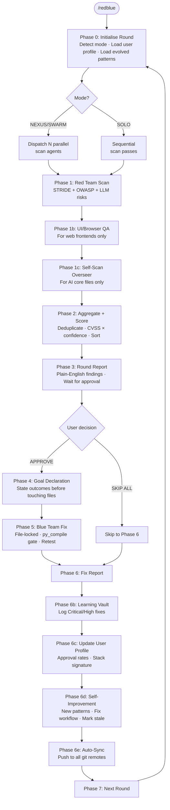
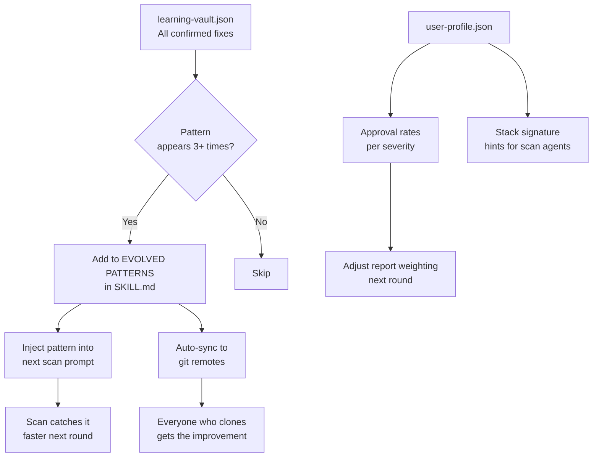
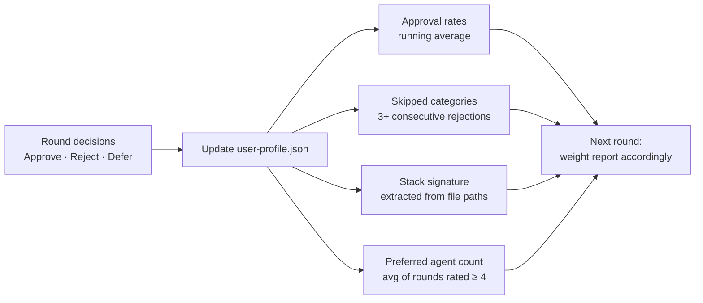

# Red-Blue Loop

**Autonomous security scanning, approval, and fixing for any codebase.**
A skill for Claude Code and multi-agent AI systems.

> **by Joven Lee** · [linkedin.com/in/jovenleeweijun](https://www.linkedin.com/in/jovenleeweijun/)
> © 2026 Joven Lee Wei Jun · Licensed CC BY-NC-ND 4.0

---

## For Everyone: What is this?

Most developers only find out about security problems after something breaks — a data breach, a hacked account, a corrupted server. By then it's too late.

**Red-Blue Loop** is an AI skill that runs security checks on your code continuously, the same way a professional security team would — but fully automated. Think of it like having a tireless security consultant who reads every line of your code, lists everything that could go wrong, explains it in plain English, and then waits for your permission before fixing anything.

**What it does, in plain English:**
1. 🔴 **Red team** — AI agents scan your code looking for weaknesses (like a hacker would)
2. 📋 **Report** — you get a clear list of what was found, explained simply, with a severity score
3. ✅ **You approve** — nothing gets changed until you say so
4. 🔵 **Blue team** — AI agents fix only what you approved, carefully and precisely
5. 🧠 **Learns** — the skill remembers what it found and gets better at spotting the same issues next time

**Who is it for:**
- Developers who want automated security reviews without hiring a security firm
- Teams shipping fast who need a safety net catching vulnerabilities before production
- Anyone running AI agents who wants to audit the agents themselves for security holes
- Security professionals who want a repeatable, auditable scan-fix workflow

---

## For Technical Users: How it works

### Architecture

Red-Blue Loop is a **Claude Code skill** — a structured set of instructions that turns any Claude agent into a security audit COMMANDER. It orchestrates parallel specialised agents, collects structured findings, enforces an approval gate, and dispatches targeted fix agents.

It works in three modes depending on your setup:

| Mode | Requirements | Agent parallelism |
|------|-------------|-------------------|
| **SOLO** | Any Claude Code instance | Sequential — one agent does everything |
| **SWARM** | Any `delegate_task`-capable framework | Parallel scan + fix agents |
| **NEXUS** | Nexus AI framework | Full parallel + persistent memory + auto-refinement |

### Threat model

Every scan covers:
- **STRIDE** — Spoofing, Tampering, Repudiation, Information Disclosure, Denial of Service, Elevation of Privilege
- **OWASP Top 10** — injection, broken auth, security misconfiguration, XSS, XXE, IDOR, vulnerable components, logging failures, SSRF
- **LLM-specific risks** — prompt injection, trust boundary bypass, memory poisoning, tool hijacking

### Finding schema

Every finding is a structured JSON object with severity, CVSS score, reproduction steps, impact, fix direction, and a plain-English explanation.

### Self-improvement

After every round, the skill:
1. Detects vulnerability classes appearing 3+ times across rounds
2. Writes them as auto-flagged patterns in its own `## EVOLVED PATTERNS` section
3. Feeds those patterns back into every future scan prompt
4. Marks stale or false-positive patterns so agents don't chase them
5. Updates its own workflow phases when scan or fix instructions are found lacking
6. Pushes the updated skill to all configured git remotes

The skill grows better with every run. Patterns discovered in your codebase become permanent scan rules, not just one-off findings.

---

## Workflow

### Full round flow



### Agent architecture

```mermaid
flowchart LR
    subgraph COMMANDER
        C[/redblue skill\nCOMMANDER]
    end

    subgraph RED_TEAM [Red Team Agents - files only]
        R1[Scan Agent 1\nSubsystem A]
        R2[Scan Agent 2\nSubsystem B]
        R3[Scan Agent N\nSubsystem ...]
        RUI[UI-QA Agent\nbrowser + files]
        ROV[Overseer Pass\nindependent re-scan]
    end

    subgraph BLUE_TEAM [Blue Team Agents - files only]
        B1[Fix Agent 1\nFile set A]
        B2[Fix Agent 2\nFile set B]
        BN[Fix Agent N\nFile set ...]
        BRT[Retest Agent\nverify all fixes]
    end

    C -->|delegate_task| R1 & R2 & R3 & RUI & ROV
    R1 & R2 & R3 & RUI & ROV -->|findings JSON| C
    C -->|APPROVE| B1 & B2 & BN
    B1 & B2 & BN -->|fix reports| BRT
    BRT -->|PASS/FAIL| C
```

### Self-improvement loop



### User profile adaptation



---

## Security Review UI (optional)

A FastAPI router and React component are included for a visual approval interface.
Each finding shows severity, CVSS score, plain-English explanation, and Approve / Reject / Defer controls.

```
server/security.py     ← FastAPI router: /api/security/rounds
client/SecurityReview.tsx  ← React component
```

The text-based approval in Phase 3 works perfectly fine without these.

---

## Install

```bash
# Clone the repo
git clone git@github.com:jovenleewj-png/red-blue-team.git

# Create storage directory
mkdir -p ~/.redblue/rounds

# Copy the skill to your agent's skills directory
# For Claude Code / Nexus:
mkdir -p ~/.nexus/skills/red-blue-loop
cp red-blue-team/SKILL.md ~/.nexus/skills/red-blue-loop/SKILL.md

# Configure your scope
cp red-blue-team/scope.example.yaml ~/.redblue/scope.yaml
# Edit ~/.redblue/scope.yaml with your system paths
```

---

## Usage

```
/redblue                   full scan, all phases
/redblue {subsystem}       single subsystem
/redblue ui                include browser QA on web frontends
/redblue report only       regenerate last report, no new scan
/redblue fix approved      skip to blue team with pre-approved findings
/redblue solo              force single-agent mode
/redblue profile           show what the skill learned about your usage
/redblue evolve            self-improvement pass without a new scan
```

---

## Contributing

Patterns discovered in your codebase that prove universal should be contributed back.

1. Fork this repo
2. Add your pattern to the `## EVOLVED PATTERNS` section of `SKILL.md` following the existing format
3. Submit a PR with a note on how many occurrences you observed and what codebase type

All contributions are reviewed by Joven Lee before merging.

---

## PRD

See [PRD.md](PRD.md) for the full product requirements document — problem statement, goals, non-goals, requirements, and success metrics.

---

## License and Attribution

Licensed under **Creative Commons Attribution-NonCommercial-NoDerivatives 4.0 International (CC BY-NC-ND 4.0)**.

**You must:**
- Credit Joven Lee Wei Jun as the author on any output shared publicly
- Keep this notice intact when distributing this file

**You may not:**
- Sell or commercialise this skill or its methodology
- Modify and redistribute as your own work
- Use it to train any AI or ML model

Full terms: [creativecommons.org/licenses/by-nc-nd/4.0](https://creativecommons.org/licenses/by-nc-nd/4.0/)

---

**© 2026 Joven Lee Wei Jun**
**[linkedin.com/in/jovenleeweijun](https://www.linkedin.com/in/jovenleeweijun/)**
